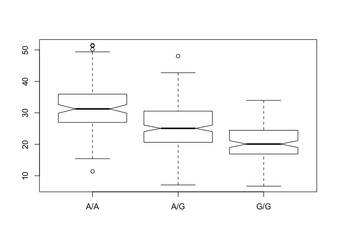

Class 13: Genome Informatics 1
================

``` r
mxl<- read.csv("373531-SampleGenotypes-Homo_sapiens_Variation_Sample_rs8067378.csv")
table(mxl)
```

    ## , , Population.s. = ALL, AMR, MXL, Father = -, Mother = -
    ## 
    ##                             Genotype..forward.strand.
    ## Sample..Male.Female.Unknown. A|A A|G G|A G|G
    ##                  NA19648 (F)   1   0   0   0
    ##                  NA19649 (M)   0   0   0   1
    ##                  NA19651 (F)   1   0   0   0
    ##                  NA19652 (M)   0   0   0   1
    ##                  NA19654 (F)   0   0   0   1
    ##                  NA19655 (M)   0   1   0   0
    ##                  NA19657 (F)   0   1   0   0
    ##                  NA19658 (M)   1   0   0   0
    ##                  NA19661 (M)   0   1   0   0
    ##                  NA19663 (F)   1   0   0   0
    ##                  NA19664 (M)   0   0   1   0
    ##                  NA19669 (F)   1   0   0   0
    ##                  NA19670 (M)   1   0   0   0
    ##                  NA19676 (M)   0   0   0   1
    ##                  NA19678 (F)   1   0   0   0
    ##                  NA19679 (M)   0   1   0   0
    ##                  NA19681 (F)   0   1   0   0
    ##                  NA19682 (M)   0   1   0   0
    ##                  NA19684 (F)   0   1   0   0
    ##                  NA19716 (F)   0   0   1   0
    ##                  NA19717 (M)   0   1   0   0
    ##                  NA19719 (F)   0   0   0   1
    ##                  NA19720 (M)   0   0   0   1
    ##                  NA19722 (F)   0   0   1   0
    ##                  NA19723 (M)   0   0   0   1
    ##                  NA19725 (F)   0   1   0   0
    ##                  NA19726 (M)   1   0   0   0
    ##                  NA19728 (F)   1   0   0   0
    ##                  NA19729 (M)   0   1   0   0
    ##                  NA19731 (F)   1   0   0   0
    ##                  NA19732 (M)   0   1   0   0
    ##                  NA19734 (F)   0   0   1   0
    ##                  NA19735 (M)   0   0   0   1
    ##                  NA19740 (F)   1   0   0   0
    ##                  NA19741 (M)   1   0   0   0
    ##                  NA19746 (F)   1   0   0   0
    ##                  NA19747 (M)   0   0   1   0
    ##                  NA19749 (F)   0   1   0   0
    ##                  NA19750 (M)   0   1   0   0
    ##                  NA19752 (F)   0   1   0   0
    ##                  NA19755 (F)   1   0   0   0
    ##                  NA19756 (M)   0   0   1   0
    ##                  NA19758 (F)   0   1   0   0
    ##                  NA19759 (M)   0   0   1   0
    ##                  NA19761 (F)   0   0   1   0
    ##                  NA19762 (M)   1   0   0   0
    ##                  NA19764 (F)   1   0   0   0
    ##                  NA19770 (F)   0   1   0   0
    ##                  NA19771 (M)   1   0   0   0
    ##                  NA19773 (F)   1   0   0   0
    ##                  NA19774 (M)   0   1   0   0
    ##                  NA19776 (F)   0   1   0   0
    ##                  NA19777 (M)   1   0   0   0
    ##                  NA19779 (F)   0   0   1   0
    ##                  NA19780 (M)   1   0   0   0
    ##                  NA19782 (F)   0   0   1   0
    ##                  NA19783 (M)   0   1   0   0
    ##                  NA19785 (F)   1   0   0   0
    ##                  NA19786 (M)   0   0   1   0
    ##                  NA19788 (F)   0   1   0   0
    ##                  NA19789 (M)   0   0   0   1
    ##                  NA19792 (M)   1   0   0   0
    ##                  NA19794 (F)   0   0   1   0
    ##                  NA19795 (M)   0   1   0   0

``` r
genotypes<- mxl$Genotype..forward.strand.
table(genotypes)
```

    ## genotypes
    ## A|A A|G G|A G|G 
    ##  22  21  12   9

FASTQ quality scores
--------------------

``` r
#install.packages("seqinr")
#install.packages("gtools")

library(seqinr)
library(gtools)
chars <- s2c("DDDDCDEDCDDDDBBDDDCC@")
chars
```

    ##  [1] "D" "D" "D" "D" "C" "D" "E" "D" "C" "D" "D" "D" "D" "B" "B" "D" "D"
    ## [18] "D" "C" "C" "@"

``` r
phred <- asc( chars ) - 33
phred 
```

    ##  D  D  D  D  C  D  E  D  C  D  D  D  D  B  B  D  D  D  C  C  @ 
    ## 35 35 35 35 34 35 36 35 34 35 35 35 35 33 33 35 35 35 34 34 31

Read the final from the worksheet we did in class today
-------------------------------------------------------

``` r
expr<- read.table("rs8067378_ENSG00000172057.6.txt", sep="")
```

``` r
table(expr$geno)
```

    ## 
    ## A/A A/G G/G 
    ## 108 233 121

``` r
inds.gg<-expr$geno=="G/G"
a<-summary(expr[inds.gg, "exp"])
```

``` r
inds.ag<-expr$geno=="A/G"
b<-summary(expr[inds.ag, "exp"])
```

``` r
inds.aa<-expr$geno=="A/A"
c<-summary(expr[inds.aa, "exp"])
```

``` r
boxplot(exp ~ geno,data=expr, notch=T)
```


