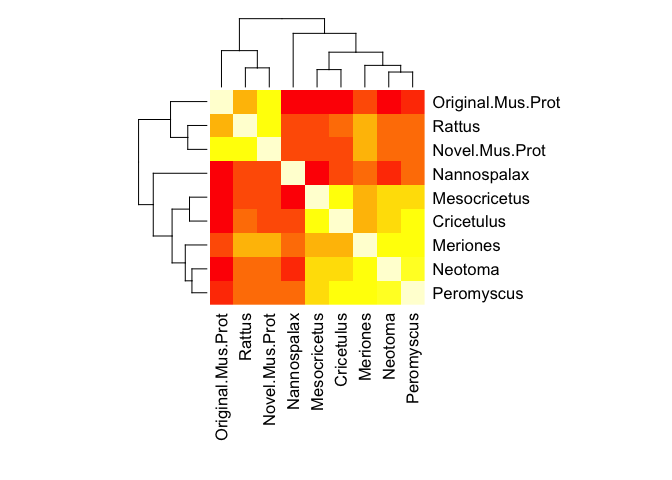

PDLIM1 Novel Gene Project
================

``` r
library(bio3d)
```

read in the fasta file for the sequence alignment from NCBI

``` r
aln.seq<-read.fasta("8EG4NN8Y211-alignment.fa")
```

Calculate the percent identity between each of the aligned sequences

``` r
pre.heat.data<-seqidentity(aln.seq)
```

Adjust the parameters to fit the heatmap and create a heatmap based on the percent identity calculation in the above code

``` r
par(oma=c(6,2,1,4))  # space for outer margins
par(mar=c(5,4,4,2) + 0.1)   # litterally did jack... oh well, I'll leave it in since I think it should change the margin size.
heatmap(pre.heat.data, symm=TRUE)
```



Align the sequences and determine one consensus sequence to do a protein database search

``` r
cons.seq<-consensus(aln.seq)
# cons.seq$seq for just the consensus sequence

b.data<-blast.pdb(cons.seq$seq)
```

    ##  Searching ... please wait (updates every 5 seconds) RID = 8G34TMJ5014 
    ##  .
    ##  Reporting 100 hits
