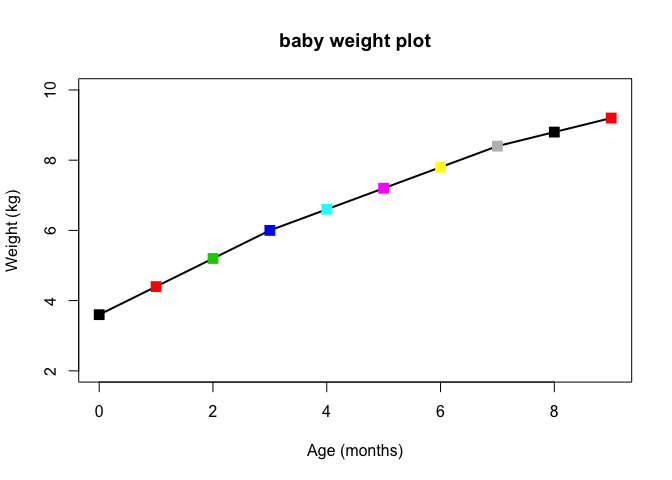
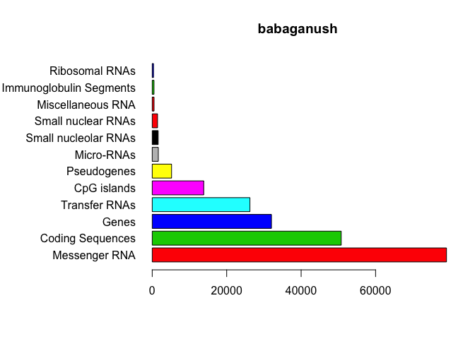
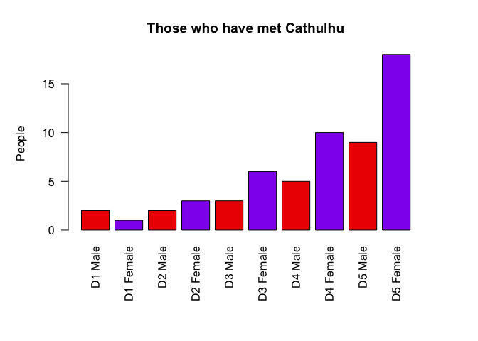
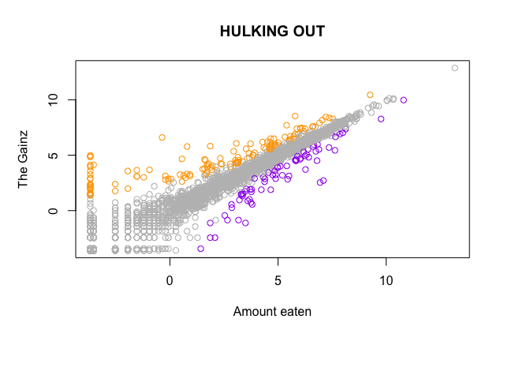

Practice Plots
================
John Jacob Jingleheimer Schmidt
Janurary 25, 2019

*I guess we aren't playing with this feature too much*

``` r
# leture05 Grafphics and plots with R

# section 2a: line plot

w <- read.table("bimm143_05_rstats/weight_chart.txt", header=TRUE)

plot(w$Age, w$Weight, type="o", pch=15, col= c(1:20), 
     cex=1.5, lwd=2, ylim= c(2,10), xlab=("Age (months)"), 
     ylab="Weight (kg)", main= "baby weight plot")
```



``` r
fc<- read.table("bimm143_05_rstats/feature_counts.txt", header=TRUE, 
                sep="\t")

par(mar= c(5.1, 11.0, 4.1, 2.1))

barplot(fc$Count, horiz = TRUE, ylab= "", 
        names.arg = fc$Feature, main= "babaganush", las=1, col=2:10)
```



``` r
mfc<- read.table("bimm143_05_rstats/male_female_counts.txt", header=TRUE,
                 sep="\t")

par(mar=c(8,5,4,4))

barplot(mfc$Count, names.arg= mfc$Sample, las=2, ylab= "People", 
        main = "Those who have met Cathulhu", col=c("red2", "purple2"))
```



``` r
ud<- read.delim("bimm143_05_rstats/up_down_expression.txt")
nrow(ud)
```

    ## [1] 5196

``` r
table(ud$State)
```

    ## 
    ##       down unchanging         up 
    ##         72       4997        127

``` r
palette(c("purple", "gray", "orange"))
plot(ud$Condition1, ud$Condition2, col=ud$State, 
     xlab="Amount eaten", ylab= "The Gainz", main= "HULKING OUT")
```


